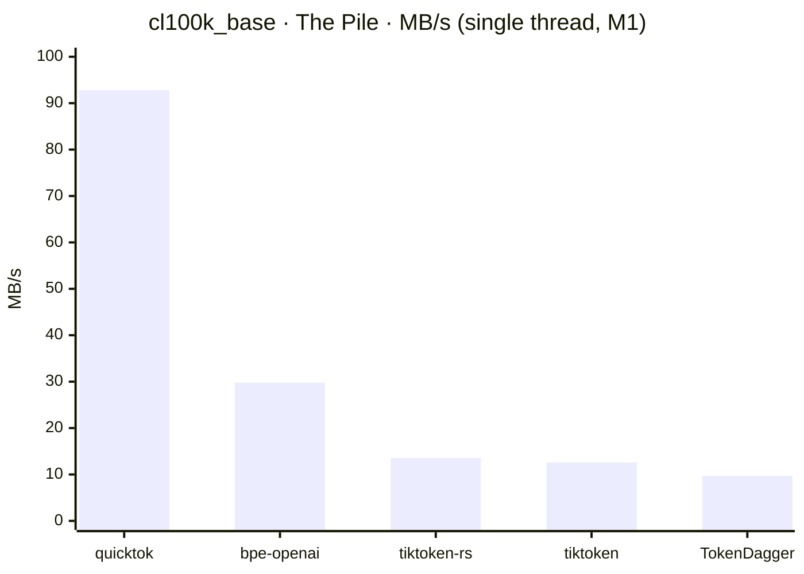

# quicktok

[](https://pypi.org/project/quicktok-v1/)
[](https://github.com/dmatth1/quicktok/actions/workflows/ci.yml)
[](LICENSE)


A fast, exact BPE tokenizer for OpenAI and open-model encodings, written in C++
with Python wheels (`pip install quicktok-v1`).
Token ids are **byte-identical to [tiktoken](https://github.com/openai/tiktoken)**;
encoding runs **2–3.4× faster** than the fastest exact tokenizer we know of
([bpe-openai](https://github.com/github/rust-gems)) and **3.5–11× faster than
tiktoken** itself.

[Benchmarks](#benchmarks) · [Install](#install) · [Quickstart](#quickstart) · [Encodings](#encodings) · [Docs](#docs)

- **Exact** — ids match each encoding's reference (tiktoken / Hugging Face / Meta) byte-for-byte; every benchmark is exactness-checked before timing.
- **Drop-in** — Python wheels with a tiktoken-style API, a stable C ABI, CMake support.
- **Self-contained** — C++20, no external dependencies; cl100k_base, o200k_base, o200k_harmony, Llama-3, and Qwen2.5/3 ship in the repo.
- **Thread-safe** — load once, call `encode()` from as many threads as you like.

## Benchmarks

Single-thread encode throughput, byte-exact vs tiktoken, every output verified
before timing. Headline: **cl100k_base on The Pile** (Apple M1).



**cl100k_base** (GPT-3.5 / GPT-4), MB/s across three 25 MB corpora:

| encoder | The Pile | Code | Common Crawl |
|---|---:|---:|---:|
| **quicktok** | **92.8** | **114.9** | **55.6** |
| bpe-openai | 29.8 | 34.1 | 24.0 |
| tiktoken-rs | 13.6 | 12.9 | 11.9 |
| tiktoken (Python) | 12.6 | 11.8 | 10.9 |
| TokenDagger | 9.7 | 10.4 | 9.3 |

The Python `encode_to_numpy()` fast path runs at near-native speed (~92 MB/s).
o200k_base, the x86 cross-check, open-model encodings (Llama-3, Qwen3, Llama-4),
batch scaling, and the full method → **[bench/README.md](bench/README.md#results)**.
Reproduce: `make bench-compare`.

## Install

**Python** (the PyPI package is `quicktok-v1`; you still `import quicktok`):

```sh
pip install quicktok-v1
```

Runs on Linux, Mac and Windows. Python ≥ 3.9 required.

**C++** — via CMake (`find_package` or `FetchContent`), or `make install` and
pkg-config. There's also a stable **C ABI** (`quicktok.h`) for FFI from any language.

```cmake
find_package(quicktok REQUIRED)
target_link_libraries(app PRIVATE quicktok::quicktok)
```

## Quickstart

**Python** — tiktoken semantics; full API in [docs/python.md](docs/python.md):

```python
import quicktok
enc = quicktok.get_encoding("cl100k_base")
ids = enc.encode("hello world")          # raises on a stray special, like tiktoken
text = enc.decode(ids)

tokens, offsets = enc.encode_batch(docs) # parallel; flat uint32 + int64 offsets
```

**C++** — full API and C ABI in [docs/cpp.md](docs/cpp.md):

```cpp
#include <quicktok.hpp>
auto tok = quicktok::Tokenizer::load_dir("data");      // cl100k_base
auto ids = tok.encode("Hello, quicktok! 日本語 🚀");   // std::vector<uint32_t>
std::string text = tok.decode(ids);                    // lossless round-trip
size_t n = tok.count("how many tokens is this?");
```

## How it's fast

Same algorithm as bpe-openai (exact backtracking BPE) — the speed is data-structure engineering:

- **2-byte trie** — the longest-match walk reads 2 input bytes per single 8-byte slot load, with a zero-lookup direct table for CJK characters.
- **Dense validity memos** — merge-validity checks hit exactly-keyed caches (2 MB for 17-bit token ids, a second wide one for 200k-vocab ids; a bijective mixer means no aliasing, ever).
- **Specialized pretokenizers** — the fixed cl100k/o200k-family regexes are compiled by hand into SIMD scanners; no general regex engine anywhere.
- **Single-pass product machines** — for ASCII text (most of code and English), one loop owns both the pretokenizer's boundary rules and token emission: contractions, prefix-words, digit triples, punct runs, and the whitespace cascade are handled inline with no per-piece scanner dispatch; only Unicode contact falls back to the general scanner, one piece at a time.

## Encodings

Five encodings ship in the repo; Llama-4's code path ships too, but its vocab is
gated. Each is byte-exact vs its reference:

| name | model family | reference |
|---|---|---|
| `cl100k_base` | GPT-3.5 / GPT-4 | tiktoken (the default) |
| `o200k_base` | GPT-4o | tiktoken |
| `o200k_harmony` | GPT-OSS | tiktoken — o200k_base plus the harmony chat specials |
| `llama3` | Llama 3 | Meta's tiktoken-rank BPE |
| `qwen3` | Qwen2.5 / Qwen3 | Hugging Face tokenizers, including its NFC normalization |
| `llama4` | Llama 4 | Meta — **not bundled** (gated; bring your own vocab) |

Per-encoding details (NFC, rank-vs-merges, gating) and **importing any other
byte-level-BPE tokenizer** → **[docs/encodings.md](docs/encodings.md)**.

## Docs

- [docs/python.md](docs/python.md) — full Python API (`encode_to_numpy`, `encode_batch`, `import_tokenizer`, `$QUICKTOK_DATA`, tiktoken semantics)
- [docs/cpp.md](docs/cpp.md) — full C++ `Tokenizer` API + C ABI
- [docs/encodings.md](docs/encodings.md) — encodings, importing other tokenizers, data regeneration
- [bench/README.md](bench/README.md) — full benchmark tables + method

## License

MIT — see [LICENSE](LICENSE).
